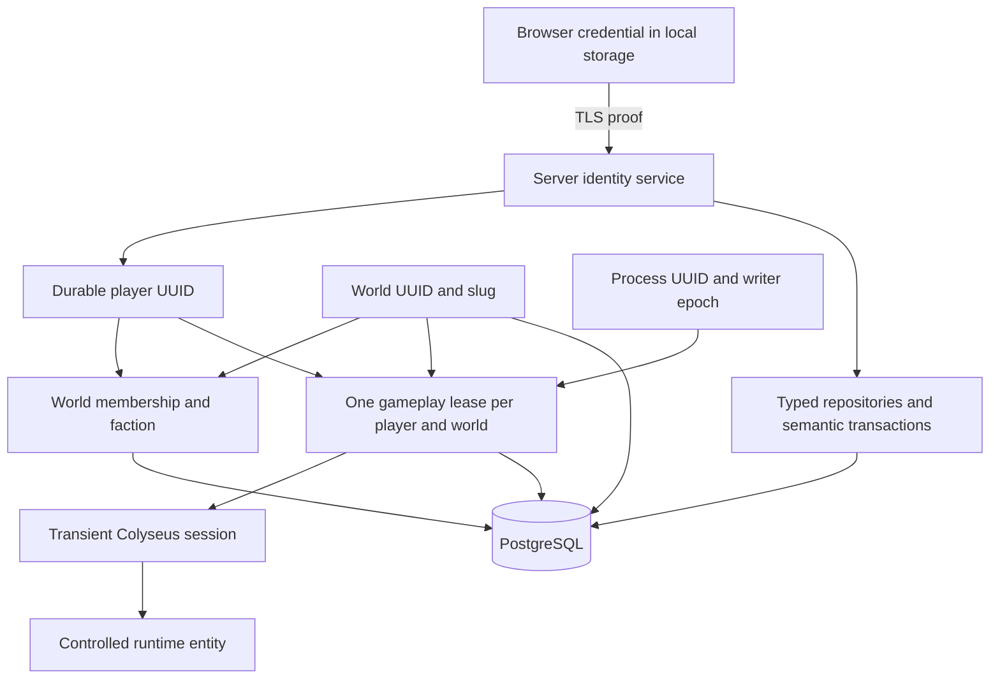

# Persistent World and Durable Identity Architecture

Date: 2026-09-13
Owner: Product Architect (explicit delegation under PERSIST-001)
Status: ARCHITECTURE DEFINED / AWAITING ARCHITECTURE/SECURITY REVIEW
Base inspected: `3b3621d248a73f67e1bed89cd3c267d5539f2c34`

Authority: [PERSIST-001](../tasks/persist-001-persistence-identity-architecture.md),
[BS-ARCH-008](../decisions/BS-ARCH-008.md),
[BS-ARCH-009](../decisions/BS-ARCH-009.md),
[BS-ARCH-010](../decisions/BS-ARCH-010.md),
[BS-ARCH-011](../decisions/BS-ARCH-011.md).

These records capture delegated PA decisions. Independent review and final PA
task acceptance remain pending. Nothing here claims persistence is implemented
or authorizes PERSIST-002 to start now. Foundation acceptance is not full Wave 2
or campaign gameplay durability.

## 1. Current model and migration boundary

At the inspected base:

- [BattleRoom](../../apps/server/src/rooms/BattleRoom.ts) onAuth checks Origin
  only. onJoin creates a spectator keyed by client.sessionId. handleSetProfile
  validates nickname/mode/red-or-blue faction, changes profile state, creates or
  removes the ship and sends PROFILE_ACCEPTED synchronously. It forbids changes
  inside a profile-ready session but tells the player to disconnect to change
  mode/faction. A fresh session can choose again.
- Participant map key and ParticipantState.sessionId, ship map key, ShipState.id
  and ownerSessionId are session IDs. Inputs/weapons/limiters also use session
  keys. None is a durable player identity or campaign DB primary key.
- [NET-001](../tasks/net-001-reconnect-ownership-lifecycle.md) and the production
  [reconnect tests](../../apps/server/test/productionReconnectLifecycle.test.ts)
  establish 10s grace (validated override 1–60s). Unclean leave neutralizes input;
  physics/combat continue. Same-session reconnect preserves participant, ship,
  health, velocity, profile and limiter buckets. Clean leave/expiry cleans up
  once. These are transient arena guarantees.
- [NetworkClient](../../apps/client/src/network/NetworkClient.ts) retains its
  Colyseus reconnect token in memory only, uses five delays
  (250/500/1000/2000/3000 ms), and discards stale callback generations. Fresh
  connection uses joinOrCreate for room name battle. The pinned reconnect path
  bypasses ordinary onAuth; WebSocket Origin enforcement remains essential.
- [Startup](../../apps/server/src/index.ts) marks ready after listening;
  [RuntimeLifecycle](../../apps/server/src/ops/runtimeLifecycle.ts) already
  distinguishes /health and /ready and supports failed/draining states. There
  is no DB gate. [Registration](../../apps/server/src/rooms/productionRoomRegistry.ts)
  registers a room class, not a singleton persistent world.

PERSIST-002 adds server-private session -> authenticated player bindings,
repositories and lifecycle composition. It need not replace every transient map
key: ownerSessionId stays runtime ownership and resolves through the binding for
durable operations. Never trust a client-supplied player or ship owner. Return
identity metadata privately; do not broadcast credentials/verifiers or require
player UUID in public snapshots.

Contract placement remains [BS-ARCH-004](../decisions/BS-ARCH-004.md) and
[BS-ARCH-005](../decisions/BS-ARCH-005.md): shared owns transitional broad
contracts, protocol exposes them, shared must not depend on protocol. DB, Node
crypto, pg, repositories and secrets belong exclusively in apps/server.

Concrete conflicts are migration boundaries: fresh-session faction reselection,
unconstrained room creation and readiness without DB must change in PERSIST-002.
No accepted BS-ARCH decision conflicts with the chosen storage model. Existing
[BS-MECH-013](../decisions/BS-MECH-013.md)/[014](../decisions/BS-MECH-014.md)
remain campaign ship-control authority: releasing a connection lease does not
authorize campaign ship switching, undocking or deleting a durable ship.

## 2. Target architecture

`playerId != client.sessionId`; worldId, roomId and serverInstanceId are separate
identifiers. Generate a new process UUID on every startup. World/player UUIDs
survive room/process recreation. Stored leases are operational coordination,
not campaign facts to restore as live clients.

## 3. Storage and consistency

PostgreSQL is canonical: relational ownership, strong transactions, uniqueness
and FKs, mature migration/backup tooling and Node/TypeScript support fit this
foundation and allow moving storage off-host later. Select pg, explicit SQL and
typed repositories; the audit found no concrete need for a large ORM. No
dependency is added here. PERSIST-002 pins supported versions/image digest.

Reject JSON/files, browser storage, Redis alone, deployed authoritative SQLite,
and a document DB chosen solely for convenience as canonical campaign stores.
SQLite requires separately justified isolated test use; acceptance exercises
actual PostgreSQL locking/transactions.

Repositories expose semantic operations, not client-selected row updates. Use
one checked-out pg client per transaction and parameterized values, consistent
with official [transactions](https://node-postgres.com/features/transactions)
and [queries](https://node-postgres.com/features/queries) interfaces. No DB writes
per 20 Hz movement tick. Only the server writes canonical state.

Use READ COMMITTED, explicit row locks, conditional updates and constraints.
Lock order: world -> player -> credential -> membership -> session lease.
Global guest creation has no world lock; cross-world writes require a later
ordering design. Every world transition locks worlds first and verifies writer
UUID/epoch and unexpired writer ownership using DB time after lock acquisition.
Hold the row lock through commit. Also verify current credential and gameplay
lease where applicable. Increment worlds.state_revision once in the same
transaction for membership creation, first faction assignment or durable world
lifecycle change. Identity-only metadata and operational heartbeats do not
increment it. Use nonnegative bigint; JSON represents revision as decimal string.

Failed transaction: no profile mutation, spawn or success. Commit then socket
failure: state remains committed. Same-faction retry is idempotent. Unknown
COMMIT outcome: query canonical state on authenticated retry, never assume
rollback or create a replacement player. Lost guest-creation response may leave
an inaccessible unused identity; an explicit new attempt can create another.
Do not store plaintext secrets to replay issuance responses.

Serialize async SET_PROFILE per session and recheck connection generation after
awaits. Disconnect during commit cannot spawn for a dead session: retain durable
membership and conditionally release that exact lease. Post-commit spawn failure
returns error/releases its lease, retaining assigned faction. Commit lease before
entity creation and acknowledgment; do not spawn first and resolve duplicates later.

## 4. Identity and credential lifecycle

Server-generated random player UUID plus 32 cryptographically random bytes
(256 bits), base64url encoded with a version prefix. Strict version/encoding/
decoded-length validation precedes lookup. Store SHA-256 of the random secret
with its version/domain separator and algorithm metadata. Never store plaintext
or accept the hash itself as bearer proof. This high-entropy random token is not
a password; a password KDF is not required for this model.

Minimum selected flow:

1. No local credential: HTTPS POST /identity/guest with explicit
   `intent: create_guest`. Transactionally create player and credential; return
   raw secret once plus playerId, Cache-Control: no-store. This is the only
   creation path; joins/authentication failures never create guests implicitly.
2. Store proof under a versioned origin-scoped localStorage key before gameplay.
   UUID metadata is only a hint. Storage failure reports inability to retain
   recovery and requires retry or explicit new-guest action; do not claim saved
   identity. Clearing browser data loses access. No email recovery is promised.
3. Fresh room join sends credential in the SDK HTTPS matchmaking POST options,
   never URL/query. onAuth preserves Origin validation and resolves server-private
   playerId/credentialId. PERSIST-002 must wire-test the pinned SDK request form.
   Recovery returns identity metadata privately, never echoes raw proof.
4. Invalid/unknown/revoked proof produces generic auth rejection, preserves saved
   proof and never falls back to the claimed identity or auto-guest. An explicit
   start-new-guest action uses step 1 to replace local proof safely.
5. First accepted player faction sets membership transactionally. Later sessions
   recover it. Contradictory requested faction is rejected; omission may use the
   stored faction. With no assignment, valid red/blue choice is required.
   Spectating never sets/clears faction. Keep existing in-session mode restrictions;
   a fresh spectator session does not forfeit membership. Nickname is validated,
   nonunique metadata under existing validation limits, never identity authority.

Guest endpoint requires approved Origin allowlist and explicit allowed-origin
CORS (no wildcard credential CORS), JSON body <=1 KiB, generic bounded errors.
New auth-boundary defaults: create burst 3/refill 1 per minute per transport peer;
fresh auth burst 10/refill 1 per second per peer; at most 10,000 peer buckets,
10-minute idle eviction, reject new buckets at cap. Apply before DB work. Do not
trust arbitrary forwarded headers: current proxy clients can share a conservative
peer budget. Trusted-proxy attribution is separate future scope. These limits do
not alter existing profile/input limits. Bound DB/handler work to 5s, bound
concurrency by the configured pool/admission queue, reject overflow, test clocks.
Guest identity does not establish one-human-one-player/Sybil protection.

Keep credential records separate. Initially one non-revoked credential per player;
retain revoked hashes. Rotation locks player/current credential, verifies current
proof, revokes old, inserts new hash and commits before returning the new raw
secret. Invalidate sessions authenticated by old credential; require reauth.
Revocation similarly invalidates associated leases/reconnects. Repository methods
and tests support this; public rotation/admin UI and unauthenticated revocation
endpoints are outside PERSIST-002. Lost rotation response may lose access; no
account-grade recovery guarantee. Future account binding extends playerId without
renaming identity. No email/password/OAuth/social login/recovery email/friends/
account marketplace or broad profile system.

## 5. Gameplay lease, reconnect and fencing

One row per (world_id, player_id) is the current gameplay claim. It carries lease
UUID, process UUID, writer epoch, room/session IDs, authenticated credential,
status, expiry and reconnect deadline. Change lease UUID on every acquisition;
old callbacks cannot release a newer claim. Multiple authenticated spectators
may exist but cannot control ships/reserve gameplay ownership. Two sessions
racing to become a player serialize on world/player/lease locks; only one wins.
Reject the second with bounded identity_in_use; never evict a healthy first owner.

Operational timing: heartbeat every 5s; world writer TTL 15s; active session TTL
G + 15s, where G is validated NET-001 grace (default 10s, range 1–60s). Persisted
time comes from DB clock_timestamp(), evaluated after locks. Expired means
expires_at <= now. Client clocks/disconnect claims are never trusted.

| Event | Required ownership behavior |
|---|---|
| Accepted player profile | One transaction checks credential, creates membership if absent, sets/checks faction, acquires active lease, increments revision if membership changed; commit before spawn/ack |
| Live heartbeat | Renew exact lease UUID/player/world/session/process/epoch only while credential and writer are valid and ownership unexpired; no revision increment |
| Unclean leave | Neutralize input immediately; mark recovering with fixed DB deadline now + G and expiry equal to deadline; start existing Colyseus grace, never extend deadline by heartbeat |
| Level 1 reconnect | Same transient session/token; before enabling input verify DB credential, writer and exact unexpired recovering lease/deadline; transition active; preserve ship/profile/limiters, no new spawn |
| Grace expiry | Finalize runtime once and conditionally release exact lease; delayed cleanup cannot touch a successor |
| Clean leave | Disable control/remove transient arena entity first, then conditionally release lease; membership remains; DB failure triggers fail-closed behavior and bounded expiry |
| Level 2 recovery | Reauthenticate durable credential after transient session is gone; acquire released/expired lease with new UUID and transport session; recover membership, not old battle transform/health |
| Old callback/process resumes | Reject stale epoch/lease UUID; heartbeat cannot resurrect expired ownership |

Pinned Colyseus reconnect bypasses onAuth. The post-allowReconnection path must
validate durable ownership before re-enabling input. A local ownership gate blocks
input/SET_PROFILE while that async validation runs, even if transport reconnect
has completed. Check credential on heartbeat and every durable transition.
Revocation through the authority invalidates local bindings immediately after
commit; missed notifications are bounded by heartbeat/local deadlines. Colyseus
token stays memory-only and distinct from locally stored durable proof.

World fencing: worlds stores current writer UUID, epoch and expiry. Boot claims
an unowned/expired world under row lock, increments epoch and invalidates prior-
epoch session leases in the same transaction. A new process must not steal a
live unexpired writer merely because its UUID differs. Graceful stop releases
writer only after quiescing control. Unclean restart waits old TTL, not forever.
Bound boot claim attempts to 30s total; DB/lock/transaction cap is 5s. A live
writer/unavailable DB leaves new process not-ready and exits failed. This is
singleton protection, not horizontal orchestration.

Heartbeat maintains a conservative monotonic local safety deadline: request
start + 10s, a 5s margin below world DB TTL. Discard responses arriving after this
deadline or after failure/shutdown generation changes. Check before each
simulation tick, input application and authoritative publication. An event-loop
pause cannot resume stale control. Session control additionally requires local
validated lease state; a lease expiry is not permission to leave an old runtime
entity controlled while accepting a replacement.

When reclaiming an expired lease in the same process, disable/finalize the old
runtime binding before enabling its successor; serialize this with heartbeat,
leave and profile handlers. Expired DB ownership alone does not remove an old
in-memory ship. A different process cannot publish old state after its local
writer safety deadline; the new process creates no entity until takeover commits.

DB/heartbeat error or local deadline expiry closes readiness immediately, stops
simulation/control and canonical writes, disconnects clients and starts bounded
shutdown. No automatic same-process recovery: restart goes through boot. Every
durable transaction checks writer epoch under the worlds row lock, so stale
queued work fails even if its DB connection later recovers. Row serialization
and bounded transactions prevent takeover racing an old in-flight commit.

Assume normal monotonic process time and no unbounded forward DB wall-clock
step. Staging time synchronization must not step the DB clock during active
ownership; unexpected discontinuity requires drain/restart. Arbitrary clock-fault
and distributed split-brain tolerance are outside the single-host foundation.

## 6. Minimum relational schema (design, not migration SQL)

Timestamps are DB/server-assigned timestamptz in UTC. UUIDs are server-generated.
FK deletes use RESTRICT by default, never accidental durable-data cascades.

| Table | Keys, fields and constraints |
|---|---|
| worlds | PK world_id UUID; unique nonempty world_slug (initial public-arena); lifecycle_status CHECK active/retired; created_at, updated_at; state_revision bigint >=0; domain_version positive integer; nullable writer_instance_id UUID and writer_expires_at, null together; writer_epoch bigint >=0. Writer ownership is operational, separate from lifecycle |
| players | PK player_id UUID; nullable display_name under existing nickname normalization; created_at, updated_at. No nickname uniqueness, session key, email/password or global faction |
| player_credentials | PK credential_id UUID; player_id FK players; version/algorithm; credential_hash 32-byte SHA-256 NOT NULL UNIQUE including revoked hashes; created_at, revoked_at nullable; partial UNIQUE player_id WHERE revoked_at IS NULL; UNIQUE(player_id, credential_id) for composite reference; no raw secret |
| world_memberships | PK(world_id, player_id), FKs worlds/players; nullable faction CHECK red/blue; created_at, updated_at, faction_assigned_at; faction/assigned_at null together or both set. First authenticated participation creates membership (spectator may have null faction). Assigned faction is immutable in foundation |
| active_session_leases | PK(world_id, player_id), composite FK membership; lease_id UUID UNIQUE; credential_id with composite FK(player_id, credential_id); server_instance_id UUID; writer_epoch bigint; room_id, transport_session_id text; UNIQUE(server_instance_id, transport_session_id); status CHECK active/recovering/released; acquired_at, updated_at, expires_at; reconnect_deadline required only for recovering, whose expiry equals deadline; released expiry <= updated_at. Reacquisition changes lease UUID |
| schema_migrations | PK positive version; unique filename; checksum SHA-256; applied_at; migration/application commit when available. Only successfully applied rows, committed with migration; status compares ordered files/checksums/version |

No server_instances table is needed: worlds holds current writer epoch/lease;
session server_instance_id is operational UUID data, not a fictional FK. Boot
invalidates prior epochs after legitimate takeover, never simply all foreign
process UUIDs. Instance history can be added later.

Enforce faction immutability both in locked repository transitions and a DB
update guard rejecting changes/clears of non-null faction. Runtime privileges
cannot bypass the guard; future faction transfer requires explicit mechanic/admin
authorization and migration. Revoked credentials cannot be unrevoked. No account
deletion or hard-delete API. No durable ship/projectile/sector tables.

## 7. World boot, stop and room lifecycle

Initial slug is public-arena. Proposed explicit operator command world:bootstrap
on migrated DB inserts one active world, UUID, revision 0 and domain version 1.
Same slug is idempotent; retired/incompatible world fails, never recreates.
Normal startup and BattleRoom do not create missing worlds. Runtime role cannot
bootstrap/retire worlds; operator/bootstrap role owns those actions.

1. Validate configuration, generate new process UUID; readiness false.
2. Establish DB/pool with bounded timeouts.
3. Verify ordered migrations/checksums and supported schema/domain version.
4. Resolve bootstrapped slug; missing world fails with operator guidance.
5. Claim singleton writer under section 5; load durable metadata/membership as
   needed under that epoch, never instantiate stored session IDs as clients.
6. Invalidate stale operational leases; preserve UUIDs/factions/revisions.
7. Create exactly one canonical battle room for the world. A non-secret,
   readiness-gated discovery response supplies its current room ID; client uses
   joinById, replacing unconstrained joinOrCreate on this campaign path. Full room
   rejects admission, never creates another world/room. Keep canonical room alive
   while process owns world, even with zero clients.
8. After recovery, room creation and heartbeat succeed, advertise /ready 200 and
   accept identity/join/participation traffic. /health remains liveness-only.

Room replacement requires disabling old control and finalizing its leases before
replacement creation under the same world epoch. Minimum implementation treats
unexpected room disposal as application failure and restarts through boot; no
transparent parallel room writer. Graceful shutdown marks not-ready, rejects
requests, quiesces gameplay, finishes bounded transactions, finalizes leases,
releases writer by process/epoch, closes DB/server. Crash/timeout uses TTL recovery.

Retirement is future explicit operator action while drained: mark retired,
retain rows, deny boot/joins, never recycle UUID/slug. Multi-world runtime,
retirement tooling and deletion are not PERSIST-002.

## 8. Durability classes

| Class | State and restart promise |
|---|---|
| Durable | Player UUID, verifier/revocation, membership/faction, optional display name, world UUID/slug/lifecycle/domain metadata/revision; acknowledged semantic changes survive application restart |
| Stored operational | Writer/session leases, process/session/room labels/expiry; stored for coordination, invalidated on recovery; backups do not reactivate them |
| Transient | WebSocket, raw Colyseus sessionId as identity, reconnect token, input queues/samples, projectiles, limiter buckets, UI/network diagnostics, frame/tick intermediates |
| Later classification gate | Active ship transform/velocity, live health, respawn timers, cooldowns, disconnected ship/control state and other high-frequency battle data; no new persistence semantics chosen |
| Later durable campaign domains | Ownership/infrastructure/control changes whose loss violates campaign truth require semantic transactions after their data/recovery contract is approved |

PERSIST-002 may reset existing arena battle state on restart as today; proof is
identity/world/faction only. This does not decide future campaign ships/health
are disposable. BS-MECH-014's retained ship and
[BS-MECH-024](../decisions/BS-MECH-024.md)'s destroyed turret cannot be erased by
connection recovery when integrated. Later wave acceptance remains separate.

## 9. Migration, compatibility and rollback

Proposed db:migrate command is explicit operator invocation with migration role,
never startup/BattleRoom side effect. Append-only numbered SQL files plus SHA-256
ledger. Serialize runner lifetime with a dedicated PostgreSQL session advisory
lock in a reserved migration namespace, holding the same checked-out connection
until completion/failure. PostgreSQL provides session/transaction advisory locks
and [pg_locks inspection](https://www.postgresql.org/docs/current/explicit-locking.html).

Prevent schema-check/migration races: this reserved schema-maintenance lock is
exclusive for migrations and shared for each application process. Runtime takes
the shared session lock on a dedicated connection before schema verification and
holds it until quiesced shutdown; monitor that connection and fail closed on loss.
Migration requires all applications drained and shared locks released; contention
fails within 5s. Bootstrap uses the shared lock while checking schema and creating
world. Thus migrations cannot run between runtime schema check and admission.
This gate is independent of row-based world writer leases and does not require
schema tables to exist for the first migration.

Each foundation migration and successful ledger insertion commit in one
transaction. All initial migrations must support transactions. Lock contention,
timeout, gaps, checksum drift, duplicate version or failure exits nonzero. Failed
transaction leaves neither partial schema nor success row. Future nontransactional
DDL requires a separately reviewed intermediate-state/recovery plan. Proposed
db:migration-status reports applied/expected versions and mismatches without secrets.

Initial application supports exactly schema version 1/domain version 1 and its
expected checksum manifest. Missing/older/newer/drifted/partial state fails closed.
Future releases declare compatible schema ranges and known manifests for expand /
migrate / contract; greater version alone does not establish compatibility.
The pre-persistence binary is not a safe campaign rollback: it lacks durable
identity/lease authority even if it can still run an in-memory arena.

Application rollback is allowed only to a binary proven compatible with schema
AND identity/authority contract. Expand first, deploy compatible consumers,
backfill explicitly, contract in a later reviewed release. Destructive migrations
require a verified pre-migration backup and restore rehearsal. Database rollback
after destructive change means restore to a clean DB and switch while drained,
accepting the backup's data cut with operator approval. Automatic DOWN is neither
presumed safe nor required. No pretend reversible destructive migration.

## 10. Configuration, secrets and staging topology

Inject DATABASE_URL privately; migration credentials are separate (conceptually
MIGRATION_DATABASE_URL available only to the runner). Select world with
BURNINGSPACE_WORLD_SLUG=public-arena. Redact connection strings, credential fields
and DB errors at logger, HTTP/SDK/proxy boundaries. No Vite/public secret variables.
PERSIST-002 defines bounded pool/admission sizing and driver/server timeouts;
5s operation/lock/idle-in-transaction caps enforce fencing, with reserved capacity
for heartbeat. Preserve durable commit settings (fsync and synchronous_commit).

Shared Contabo staging: one PostgreSQL service/container on the same host, no
published host port, private application/database Docker network only, persistent
named volume outside application lifecycle, explicit healthcheck. Only server
and bounded migration/backup tooling reach DB; no unnecessary edge/client network
attachment. Preserve unrelated host services. Container health is not campaign
readiness. Application restart must not delete the DB volume. No VPS contact,
compose implementation, volume deletion or host setup is authorized by PERSIST-001.

Runtime role: required application DML and migration metadata SELECT, no arbitrary
DDL/role management, bootstrap or ledger writes. Separate migration/owner and
backup/restore operator privileges; runtime is not superuser and cannot disable
constraints/triggers. Revoke unnecessary schema creation. Any temporary staging
shortcut in PERSIST-002 records exact privilege gap and closure owner explicitly.

This is staging, not final production topology. Managed/external PostgreSQL later
uses the same repository API, private connectivity and verified DB TLS. Internal
plaintext DB traffic is allowed only on this isolated same-host network. Browser
auth/join always uses HTTPS/WSS. Production HA/capacity/volume migration requires
separate operations scope.

## 11. Backup and restore

Use PostgreSQL-native custom archive pg_dump -Fc and pg_restore into a freshly
created isolated DB, supported by official
[pg_dump](https://www.postgresql.org/docs/17/app-pgdump.html) and
[pg_restore](https://www.postgresql.org/docs/18/app-pgrestore.html) documentation.
These documentation versions do not pin the deployed database major version.

Back up whole application DB: schema, data, constraints/indexes, migration ledger,
players/verifiers/revocations, worlds/memberships and operational rows. Document
role/grant recreation separately: one-DB dump is not cluster role/secret backup.
Provision secrets separately. Treat dumps as sensitive; restrict access, encrypt
storage/transfer, never publish row dumps as logs/repository evidence.

Name: burningspace-<world-slug>-<UTC>-schema<v>-<appSHA>.dump plus manifest with
SHA-256, UTC start/end, DB/tool major versions, migration checksums/version, app
commit, world UUID/revision. Drain writers for acceptance backup so its revision
matches the cut; a query outside a live dump snapshot cannot prove exact revision.
Keep original credential fixture operator-private, never in metadata, shell
arguments, logs or evidence. Backups contain verifiers, not raw proof.

Restore only to an explicitly identified fresh, non-serving isolated DB. Verify
archive checksum; provision restricted roles; restore without unwanted source
owners/ACLs, reapply intended grants and fail on restore errors. Check ledger,
checksums, FKs, counts, UUID/faction/revision against manifest. Start one app on
the target: invalidate restored leases during boot (old writer TTL may need to
expire), authenticate original private fixture, verify same durable state with a
new session. Revoked fixture must fail; runtime cannot perform DDL. Never expose
restored test world to public clients alongside original world.

PERSIST-002 must complete one real backup/restore cycle, recording commands,
redacted outputs, exit codes, before/after IDs and revisions bound to its commit.
A never-restored dump is not evidence. Snapshot recovery loses changes after
backup; no zero-RPO promise. Production RPO/RTO, retention/off-host copies and
scheduled automation are later operations gates, not scheduled here.

## 12. Failure and threat model

| Failure | Required behavior |
|---|---|
| DB unavailable at boot | /ready fails (503 if listening, otherwise failed process exit); /health liveness only; no memory-only fallback |
| Schema/domain mismatch or missing world | Fail closed; generic client error and bounded non-secret operator diagnostic |
| DB/heartbeat lost in runtime | Not-ready; stop simulation/control/durable success; bounded shutdown; verified boot required |
| Duplicate gameplay session | Reject second claimant, preserve first healthy owner |
| Invalid/revoked proof or forged UUID | Generic rejection, no takeover or silent guest fallback |
| Failed/unknown commit | No premature success; authenticated retry reads canonical outcome |
| Crash/stale lease | Bounded writer TTL and boot epoch reconciliation; old callback cannot release successor |
| Response lost after commit | Durable membership remains, retry recovers it |
| Clean leave DB error | Local control stops first, fail closed, expiry/restart resolves stored claim |

| Threat | Mitigation and limitation |
|---|---|
| Stolen recovery secret/XSS | TLS, reduced exposure/no logging; local storage is accessible to compromised origin/device. Possession is identity proof; no MFA/email/account-grade recovery |
| Raw token logging | Exclude bodies/options/authorization/DB URLs from logs; sanitize SDK/proxy errors; secret-canary tests on failure paths |
| DB/backup disclosure | Only high-entropy hash, restricted grants/backups; hash is not bearer proof. DB write compromise can corrupt authority and is not solved by hashing |
| Concurrent token reuse | Unique player/world lease transaction before spawn; no last-login-wins eviction |
| Stale process/partition | Writer epoch, lease UUID conditions, local deadlines, fail-stop, boot expiry and explicit clock assumption |
| Enumeration | No nickname/UUID lookup endpoint, generic unknown/revoked responses, bounded auth attempts; UUID alone proves nothing |
| Forged player UUID/ownerSessionId | Server-private authenticated binding establishes ownership; validate requests, ignore/reject claimed authority |
| Faction spoof/reload | Lock/check membership plus DB immutability guard; reject mismatch; spectating never changes assignment |
| Revoked proof/old reconnect token | Checks at auth, transitions, heartbeat and Level 1 resume; local invalidation and no unrevocation |
| Guest flood/Sybil | Pre-DB rate/body/concurrency limits; not one-human-one-player identity; broader abuse controls later |
| SQL injection | Fixed parameterized queries and restricted roles; no client SQL/arbitrary identifier interpolation |

## 13. PERSIST-002 acceptance contract

Requires PA acceptance of PERSIST-001 and a committed bounded implementation task
with reviewer declaration. Minimum slices: server-only pg/repositories, migrations
and runner/status/bootstrap commands, world readiness/lifecycle, guest creation
and authenticated join, transactional faction/leases, minimal client credential/
error integration, internal staging DB definition, real PostgreSQL integration
and backup evidence. Staging definition is not authorization for VPS execution,
image publication or deployment. No broad auth UI.

Exact vertical proof, with redacted IDs/revisions and app/schema commit bindings:

1. Start PostgreSQL with durable volume and isolated network.
2. Explicitly migrate empty DB and verify migration status.
3. Explicitly bootstrap world idempotently, then start application server.
4. Confirm one canonical world exists and readiness follows recovery.
5. Browser/client without credential creates and locally stores a durable guest identity.
6. Player selects valid faction once through accepted participation.
7. Verify player UUID, world UUID and faction committed in DB.
8. Disconnect; record cleanup and persisted membership.
9. Stop/restart APPLICATION SERVER while DB remains; also repeat with kill while active.
10. Reconnect using the same retained durable credential.
11. Recover the exact same player UUID.
12. Recover the exact same faction and world UUID.
13. Observe a different transient Colyseus sessionId and new process UUID.
14. Prove concurrent second claimant cannot obtain a second lease/controlled ship.
15. Prove dead-instance stale ownership is reclaimable within specified boot bound.
16. Prove invalid/revoked proof and forged UUID cannot claim another player.
17. Produce native custom-format backup and redacted manifest.
18. Restore into an explicitly fresh isolated database.
19. Prove identity/world/faction/revision and revocation restored; old sessions do not reactivate.

Also mandatory: simultaneous first-faction choices (one membership result/owner),
same-faction retry after lost ack, mismatching faction on reload, spectator
neutrality, Level 1 same-token continuity of ship/session/limiters within NET-001
grace, late reconnect/delayed cleanup, two live tabs, revoke/rotate replay including
Level 1, clean/unclean leave, async profile/disconnect race, stale callback after
epoch takeover, empty-room continuity and room-full rejection without second
world creation. Test secrets absent from snapshots/logs/URLs, auth rate limits,
local storage failures and pinned SDK POST proof delivery.

Exercise DB loss at boot/runtime, delayed heartbeat/event-loop pause, failed and
unknown commits, two migration runners, transactional migration failure,
checksum/version mismatch, incompatible application rollback rejection, compatible
rollback rehearsal (or explicit rejection if none exists), restricted privileges
and fresh-target restore. Use actual production server/room and PostgreSQL, not
only mocks/SQLite. Run build/typecheck, existing authority/network/reconnect
regressions and focused persistence tests. PERSIST-002 declares Architecture,
Network, Security and QA coverage plus governed PR checks.

## 14. Deferred gates and non-goals

No open architecture choice is delegated to PERSIST-002 for storage, identity,
faction authority, leases, relational shape or boot/restore semantics. Dependency
versions, pool sizing, file names and test harness details are bounded technical
choices within this contract, not permission to redesign it.

Deferred: durable classification/recovery of active ship transform/health,
respawn/cooldowns and disconnected campaign ships; later campaign transaction
models; production DB HA/topology/RPO/RTO/retention; retirement/admin authority;
trusted-proxy per-user rate attribution; future account binding and recovery UX.
These do not block the identity/world/faction proof, but block claims of complete
campaign durability, ship-control continuity or production operations.

No sectors, capture, outposts, turrets, economy, mining, logistics, portals,
horizontal scaling, persist-every-tick movement or durable projectiles. No new
mobile task. No runtime/deploy/package/SQL/secret changes in PERSIST-001.
